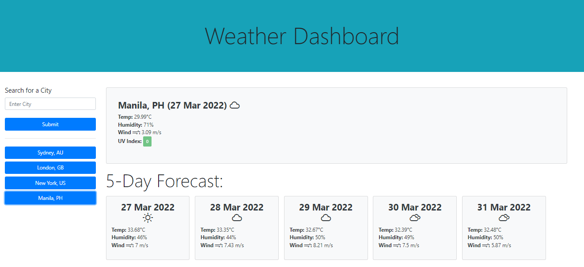

# API Weather Dashboard

## Description

This weather dashboard shows the current weather conditions and five-day forecast of the city entered in the search box. Weather details such as temperature, wind speed, humidity, and UV Index are shown. A weather icon is also shown after the date and UV Index are highlighted to either green, yellow, or red to indicate whether the conditions are favorable, moderate, or severe respectively.

The application is done using HTML, CSS, and JavaScript powered by third-party API's such as Bootstrap, Moment.js, and OpenWeather's GeoCoding and One Call APIs.

## Features

* Country code (ISO 3166) for cities that have the same name but are in different locations can be added to specify that city. 
```
{cityName},{countryCode}
e.g.
London,CA or London,GB
```

* If no country code is added, the program would use the details of the first matched city in the GeoCoding API response i.e. entering Sydney would show the weather conditions in Sydney,AU.

* Buttons for previously searched cities would be available below the search form. Clicking those buttons would show the weather conditions of that city.

## Website

The following image shows the web application's appearance and functionality:



## Demo

Visit [this](https://alainatividad.github.io/API-Weather_Dashboard/) to see the webapp in action.

## Credits

[OpenWeather (TM)](https://openweathermap.org) is the weather data provider of this application.

The weather icons are by [Erik Flowers](https://github.com/erikflowers/weather-icons).
