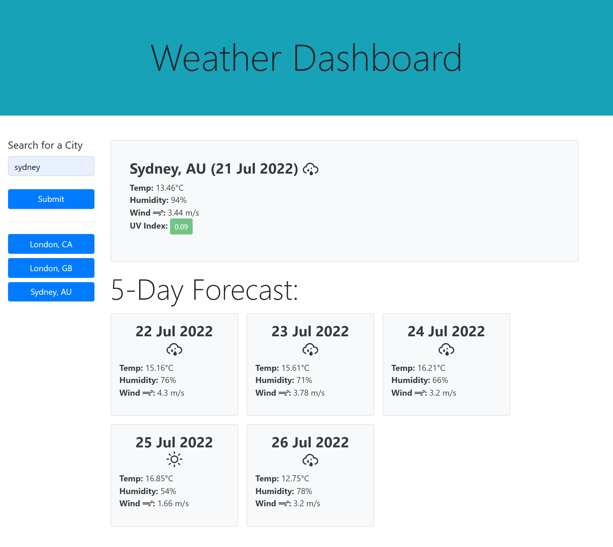

# API Weather Dashboard

## Description

This weather dashboard shows the current weather conditions and five-day forecast of the city entered in the search box.

The application is done using HTML, CSS, and JavaScript powered by third-party API's such as Bootstrap, Moment.js, and OpenWeather One Call.

## Website

The following image shows the web application's appearance and functionality:

## Demo

Visit [this](https://alainatividad.github.io/API-Weather_Dashboard/) to see the webapp in action.

## Credits

[OpenWeather (TM)](https://openweathermap.org) is the weather data provider of this application.

The weather icons are by [Erik Flowers](https://github.com/erikflowers/weather-icons).
